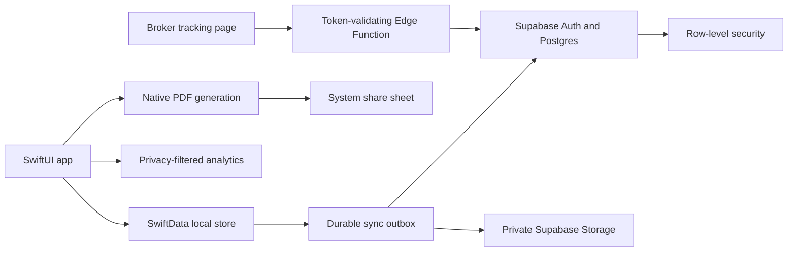

# HaulMate Launch Technology Stack

**Decision:** Build one native platform for the pilot. Default to an iOS app in SwiftUI because that is the founder's strongest and fastest environment. Confirm this choice against the first 12 recruited drivers before implementation; use the Android stack in section 11 instead if the cohort is predominantly Android.

Do not build both clients, adopt React Native, or introduce Kotlin Multiplatform before the core workflow is validated.

## 1. Recommended iOS stack

| Layer | Choice | Launch cost | Reason |
|---|---|---:|---|
| App and UI | Swift 6 + SwiftUI | $0 | Uses existing senior expertise and first-party frameworks |
| Architecture | Feature modules with Observation and repository boundaries | $0 | Simple native data flow without a third-party architecture framework |
| Local/offline data | SwiftData with explicit migrations | $0 | First-party persistence and a durable local outbox |
| Networking | `supabase-swift` behind app-owned protocols | $0 | Fast access to Auth, PostgREST, Storage, and Edge Functions |
| Backend | Supabase Postgres | $0 for pilot | Relational data suits loads, stops, charges, documents, and invoices |
| Authentication | Supabase Auth, email/password | Included | Avoids a separate identity vendor |
| File storage | Supabase private Storage buckets | Included | Simplest ownership and signed-URL model for the pilot |
| Server functions | Supabase Edge Functions | Included | Only for privileged operations; no separate API server |
| Camera and imports | VisionKit, PhotosUI, and file importer APIs | $0 | First-party document scanning and file selection |
| PDF generation | Core Graphics/UIGraphics PDF renderer | $0 | Native invoice generation without a PDF subscription |
| File sharing | SwiftUI share link or `UIActivityViewController` | $0 | Uses the driver's installed mail or messaging app |
| Location evidence | Core Location | $0 | Explicit timestamp and GPS capture; geofencing remains P1 |
| Credential storage | Keychain | $0 | Protects local session material |
| Background uploads | Background `URLSession` | $0 | System-managed document transfer that survives suspension |
| Broker visibility page | Static TypeScript page on Cloudflare Pages | $0 | A no-login, mobile-friendly view outside the native app |
| Share-link API | Supabase Edge Function | Included | Validates a scoped token and returns only approved load fields |
| Product analytics | PostHog free tier, privacy-filtered | $0 | Measures workflow use without exposing load content |
| Source and CI | GitHub Free + GitHub Actions | $0 at pilot scale | Private repo and included CI minutes |
| Beta distribution | TestFlight | Included with Apple membership | Direct pilot distribution and feedback |

Use Apple frameworks directly unless a third-party package removes substantial, measured work. The financial formulas and sync engine should be ordinary Swift modules with deterministic tests.

## 2. Why the recommendation changed

### Engineering time is part of cost

Expo has a free tier, but its cash price is not the relevant difference for a solo senior native developer. React Native would add JavaScript tooling, native bridge behavior, dependency compatibility, and another debugging model. A `$74` difference between Apple and Google developer fees is smaller than even a few hours of avoidable framework learning.

### SwiftUI first, subject to the pilot cohort

SwiftUI is the default because it is the fastest path with current expertise. Before creating the Xcode project, recruit the intended pilot drivers and record their phone platform. Proceed iOS-first when enough real pilot users have iPhones; switch to the Android stack when access to Android drivers would otherwise block validation.

This is a distribution decision, not an architecture debate. The product should go where the reachable users are.

### No cross-platform layer yet

The pilot needs one client and one backend. Kotlin Multiplatform would create shared-build, interop, dependency, and migration decisions before there is a second client to benefit. React Native would similarly trade native fluency for hypothetical reuse.

When a second platform becomes justified, share these assets instead of the UI implementation:

- Postgres schema and row-level-security policies.
- OpenAPI/database contracts and generated fixtures.
- Profit, detention, and invoice calculation test vectors.
- Product language, screen specifications, and design tokens.
- Analytics event names and acceptance tests.

Consider KMP only after both clients exist and duplicated domain or sync code has become a demonstrated maintenance cost.

## 3. Backend decision

Supabase provides Postgres, authentication, storage, row-level security, and server functions in one service. The pilot can remain on the free plan. Upgrade before public production when backups, non-pausing service, support, or higher storage become necessary.

Keep `supabase-swift` behind app-owned `AuthClient`, `LoadRemoteStore`, and `DocumentStore` protocols. This preserves fast implementation without coupling the domain and UI directly to a vendor SDK.

## 4. Scope decisions that save money

### Explicit events instead of continuous tracking

The MVP records location when the operator taps Arrived or Departed. This avoids continuous background processing, reduces battery and privacy concerns, and simplifies App Review. Geofence assistance can be added after drivers prove that detention evidence is valuable.

### Share sheet instead of an email vendor

Invoice PDFs are generated locally and shared through the device. This avoids transactional email infrastructure, domain reputation work, attachment delivery failures, and another service. Automated sending becomes P1.

### Manual-reviewed entry before AI extraction

The pilot attaches the original rate confirmation and uses fast structured entry. Vision text recognition can later suggest fields on-device, but every value remains user-reviewed. Do not pay for generative extraction until the team has a representative document set and measured manual-entry friction.

### Native Maps handoff instead of a maps SDK

Store addresses and coordinates, then open Apple Maps for navigation. HaulMate does not need embedded maps, truck routing, or paid map tiles to prove the load-to-cash workflow.

### Scoped broker link instead of a broker application

The pilot exposes one responsive web page per shared load. A broker does not create an account and cannot browse the operator's data. The driver publishes an on-device ETA and normal status events update the page after sync. This proves whether visibility reduces check calls before HaulMate invests in continuous tracking, a broker dashboard, messaging, or a second product surface.

## 5. Pilot architecture

The app is local-first. User actions commit to SwiftData immediately and create idempotent outbox operations. Sync pushes those operations to Supabase and reconciles server results. The mobile app uses the public project key; row-level security is the authorization boundary. Privileged service keys exist only in Edge Functions.

## 6. Initial data model

Use UUID primary keys generated on-device so records can be created offline.

| Table | Purpose |
|---|---|
| `business_profiles` | User-owned business identity, invoice defaults, and factoring remittance details |
| `vehicles` | Equipment and default operating costs |
| `customers` | Broker, shipper, receiver, or direct customer details |
| `loads` | Commercial terms, miles, state, and calculated summary |
| `stops` | Pickup, delivery, and extra-stop appointments |
| `trip_events` | Immutable arrival, departure, status, GPS, and correction events |
| `charges` | Line haul, fuel surcharge, detention, and other accessorials |
| `expenses` | Fuel, toll, lumper, and load-specific operating costs |
| `documents` | Private object key, type, hash, size, and sync state |
| `invoices` | Invoice revision, dates, totals, and payment status |
| `invoice_items` | Billed line items and linked evidence |
| `payments` | Full or partial payment records |
| `sync_operations` | Server idempotency replay ledger and reconciliation metadata |
| `tracking_shares` | Hashed per-load link tokens, visibility settings, expiry, and revocation |
| `eta_updates` | Published ETA, source, delay reason, and freshness timestamp |

All owned server tables include `user_id`, `created_at`, and `updated_at`. Evidence tables append corrections rather than overwriting original events.

Do not mirror every server table mechanically into SwiftData. Persist the active workflow, offline dependencies, and sync metadata the app actually needs.

## 7. File strategy

- Store private objects under `user_id/load_id/document_id`.
- Scan or import into the app's private container.
- Compress photographed pages to a readable target before upload.
- Keep the local original until the server confirms the upload and metadata transaction.
- Use a background `URLSession` for large or interruption-prone transfers.
- Store SHA-256, MIME type, byte size, capture time, and source.
- Use short-lived signed URLs for remote viewing.
- Exclude document bytes and metadata values from analytics and crash reports.

The free Supabase tier currently includes 1 GB of file storage. That is enough for a deliberately small pilot, not an unrestricted public launch. If documents become the dominant cost, evaluate Cloudflare R2 while keeping metadata and authorization in Postgres. Starting with two storage vendors would save little during the pilot and add avoidable implementation work.

## 8. Cost plan

### Closed iOS pilot

| Item | Expected cost |
|---|---:|
| App, broker page, database, authentication, pilot storage, analytics, and CI | $0/month within free limits |
| Apple Developer Program and TestFlight distribution | $99/year |
| Domain for legal/support pages | Approximately $10-$20/year, registrar dependent |
| Total required platform spend | Approximately $109-$119 in year one |

### Cash-minimum Android alternative

| Item | Expected cost |
|---|---:|
| App, broker page, database, authentication, pilot storage, analytics, and CI | $0/month within free limits |
| Google Play developer registration | $25 one time |
| Domain for legal/support pages | Approximately $10-$20/year, registrar dependent |
| Total required platform spend | Approximately $35-$45 in year one |

A new Google Play personal developer account must currently run a closed test with at least 12 opted-in testers for 14 continuous days before applying for production access.

### First likely recurring upgrade

Supabase Pro currently starts at $25/month. Upgrade before public production if the app needs non-pausing service, automated backups, more file storage, or production support. Do not design the business around a free production database.

## 9. Free-tier limits to watch

- Supabase Free: two projects, 500 MB database per project, 1 GB file storage, 5 GB egress, and projects may pause after a week of inactivity.
- GitHub Free private repositories: 2,000 Actions minutes per month.
- PostHog product analytics: 1 million events per month in the current free tier.
- Google Play personal accounts: the closed-test requirement can add at least 14 days to an Android public-launch timeline.

Free-tier allowances and store rules can change. Recheck them immediately before accounts are created or the app is submitted.

## 10. Cost controls and upgrade triggers

- Do not add paid maps, SMS, email, AI/OCR, accounting, ELD, load-board, or bank integrations in P0.
- Publish ETA and status, not continuous location, in P0.
- Record analytics events, never entire load payloads.
- Compress documents before upload and reject unexpectedly large files with a recovery path.
- Set Supabase and GitHub spend caps to zero during the pilot where supported.
- Add a paid service only when a measured pilot problem justifies it.

| Trigger | Action |
|---|---|
| Pilot proves retention and invoice use | Upgrade Supabase before public launch |
| Storage exceeds 70% of pilot quota | Tighten compression or evaluate Cloudflare R2 |
| Drivers abandon manual load entry | Add Vision-based OCR suggestions |
| Detention events are frequent and valuable | Add opt-in geofence assistance |
| Share-sheet invoicing causes missed sends | Add automated transactional email |
| Shared pages measurably reduce check calls | Add background ETA refresh and a multi-load broker dashboard |
| More than one person manages a carrier | Add organizations, roles, and web back office |
| A second mobile platform has committed users | Build its native client, then reassess KMP from measured duplication |

## 11. Android fallback stack

If the recruited pilot cohort requires Android, keep the same backend and product scope and use:

| Layer | Android choice |
|---|---|
| App and UI | Kotlin + Jetpack Compose + Material 3 |
| Architecture | ViewModel, StateFlow, repositories, coroutines |
| Local/offline data | Room with explicit migrations |
| Persistent sync | WorkManager with unique idempotent work |
| Networking | `supabase-kt` behind app-owned interfaces |
| Camera/import | CameraX and Android Photo Picker/document APIs |
| OCR in P1 | On-device ML Kit Text Recognition |
| Location | Fused Location Provider with explicit event capture |
| PDF | Android `PdfDocument`/print framework |
| Sharing | `FileProvider` and Android Sharesheet |
| Credentials | Android Keystore-backed storage |
| Testing | JUnit, coroutine tests, and Compose UI tests |

`supabase-kt` is community-maintained rather than an official Supabase library. Isolate it behind app-owned interfaces and pin/test upgrades. If that dependency proves unreliable, replace the implementation with Ktor calls to Supabase Auth, PostgREST, and Storage without changing the domain layer.

## 12. Current references

- [SwiftUI](https://developer.apple.com/swiftui/)
- [SwiftData](https://developer.apple.com/documentation/swiftdata/)
- [Background URLSession](https://developer.apple.com/documentation/foundation/urlsessionconfiguration/background(withidentifier:))
- [Supabase Swift client](https://supabase.com/docs/reference/swift/introduction)
- [Jetpack Compose](https://developer.android.com/compose)
- [Room](https://developer.android.com/training/data-storage/room)
- [WorkManager](https://developer.android.com/topic/libraries/architecture/workmanager/)
- [Supabase Kotlin client](https://supabase.com/docs/reference/kotlin/introduction)
- [Supabase pricing](https://supabase.com/pricing)
- [Supabase billing and quotas](https://supabase.com/docs/guides/platform/billing-on-supabase)
- [Google Play registration](https://support.google.com/googleplay/android-developer/answer/6112435)
- [Google Play closed-testing requirement](https://support.google.com/googleplay/android-developer/answer/14151465)
- [Apple Developer membership](https://developer.apple.com/support/compare-memberships/)
- [ML Kit on-device SDK](https://developers.google.com/ml-kit/guides)
- [Cloudflare R2 pricing](https://developers.cloudflare.com/workers/platform/pricing/#r2)
- [GitHub Actions included usage](https://docs.github.com/en/billing/reference/product-usage-included)
- [PostHog pricing](https://posthog.com/pricing)
